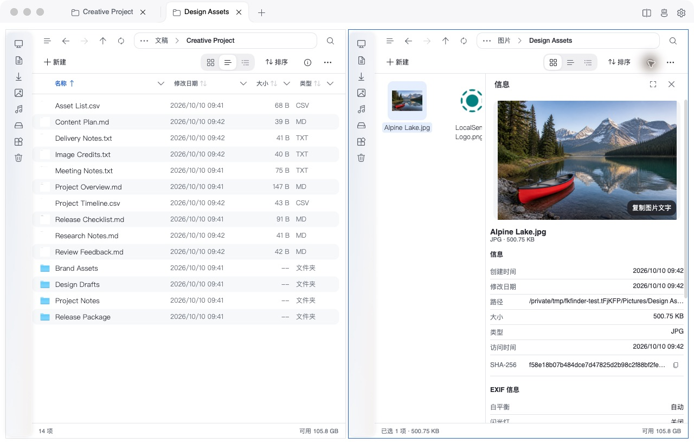

<strong>English</strong> · <a href="README.zh-CN.md">简体中文</a>

  

<h1 align="center">Mac Explorer</h1>

A file workspace for macOS: browse, find, preview, organize, and share.

  
  
  
  

  <a href="https://3egirlsdream.github.io/Mac-Explorer/">Website</a> ·
  <a href="https://github.com/3egirlsdream/Mac-Explorer/releases/latest">Download</a> ·
  <a href="CHANGELOG.md">Changelog</a> ·
  <a href="https://3egirlsdream.github.io/Mac-Explorer/privacy/">Privacy</a> ·
  <a href="https://github.com/3egirlsdream/Mac-Explorer/issues">Feedback</a>

Mac Explorer brings everyday file work into one macOS app. Keep folders side by side, gather files without moving them, search names and analyzed content, preview before opening, and handle local files, archives, and SFTP connections from the same workspace.

*Screenshot: v1.0.54, captured on October 10, 2026 with demo files in an isolated profile.*

## Features

### Tabs, split panes, and navigation

- Keep multiple locations open in tabs, each with its own navigation history, sorting, and view.
- Choose horizontal or vertical splits, three- or four-pane layouts, or a larger main pane beside smaller panes. Browse source and destination together when organizing files.
- Jump through clickable breadcrumbs, searchable subfolder menus, or direct path entry. Use Back, Forward, and Up to navigate.
- Reach pinned folders, recent locations, local volumes, and the Trash from the sidebar.

### Flexible file views

- Switch between list, icon grid, and tree list views; expand local folders directly in the tree list.
- Sort and group files by properties such as type, date, and size. Choose files first, folders first, or mixed sorting.
- Combine column filters to narrow a directory. Multiple choices in one column match any selected value; filters across columns apply together.
- Browse image thumbnails and optional photo covers for folders. Camera RAW thumbnails use a fallback when the system preview cannot decode supported files.
- Inspect paths, sizes, dates, image dimensions, camera and other photo metadata in the information panel. Calculate and copy SHA-256 hashes for local files.

### Home, favorites, tags, and ratings

- Start from a home dashboard with recent files and folders, frequent locations, favorites, and shortcuts to the home folder, desktop, and disks.
- Organize favorites in resizable grids and expand larger collections for browsing.
- Apply Finder tags and browse tagged files together from the sidebar. Tagging or adding to favorites keeps files in their original locations; removing a tag or favorite does not delete the source file.
- Assign star ratings to help organize and find important files.

### Search and local image analysis

- Search within the current workspace or open global search with `⌘ K`. Preview selected results beside the search field and reveal them in their folder.
- Search indexed filenames and existing PDF text, image OCR, and analysis results.
- Use on-device image analysis to browse people, recognized text, scene categories, and photo dates and locations. Name people groups to make them easier to find.
- Browse popular recognized words and the files containing them. Photo place-name lookup is optional and may use an online service.
- Control automatic analysis and search scope in Settings. Content search depends on the files already indexed or analyzed.

### Preview without opening another app

- Press `Space` to preview a selected file or folder in the current window.
- Preview images, PDFs, text, and supported documents and media. Browse folder and archive contents, including subfolders and nested archives.
- Read Markdown with formatted preview, or open the built-in editor to edit it and see the rendered result.
- Preview coverage depends on the file format and macOS Quick Look support; RAW coverage also depends on the camera format.

### File operations and batch rename

- Create files and folders, copy, move, rename, drag and drop, use Open With, copy paths, and move items to the Trash. Undo supported file operations.
- Track longer operations in the background task panel, with progress and cancellation where supported.
- Rename selected local files and folders across directories in the batch rename workbench. Combine replacement, regular expressions, insertion, removal, case changes, cleanup, numbering, dates, templates, and extension rules.
- Reorder rules, save presets, inspect each step, compare old and new names, exclude items, or adjust target names manually.
- Check conflicts before execution, resolve duplicate names, inspect results, and undo a completed batch.

### Archives and file conversion

- Browse and extract ZIP, TAR, 7Z, and other supported archive formats. Extract into the current folder or a separate folder.
- Create ZIP, TAR.GZ, and TAR.BZ2 archives, including password-protected ZIP files.
- Convert Markdown and supported text files to Word or PDF, and Word documents to PDF.
- Convert SVG, ICO, ICNS, and WebP to PNG or JPG, with image size options. Available conversion actions depend on the selected file.

### SFTP and Git status

- Save SFTP connections and authenticate with a password or private key. Review the server fingerprint when establishing trust.
- Browse and manage remote files, upload and download, or edit a remote file in a local app and upload the changes automatically.
- See Git status alongside files when a compatible Git installation and repository are available.

### LocalSend sharing

- Send selected local files and folders to discovered LocalSend devices from the context menu.
- Review the sending device and file list before accepting incoming files, and choose where to save them.
- Configure your device name, receive folder, and additional discovery subnets, or connect directly by IP when discovery cannot find a device.
- Follow send and receive progress in the task panel. Device discovery requires network reachability.

### File Delivery from the menu bar

- Open a compact panel from the macOS menu bar to access downloads, desktop, and your own folder or favorite tabs.
- Browse in list or icon view, preview files, and drag out copies to another app or location.
- Each entry remembers its browsing location. The panel remains available after the main window closes, until you quit the app.
- Remove panel entries without deleting their folders or favorites.

### Copilot file assistant

- Use natural language to find files, inspect metadata, organize selections, prepare rename rules, convert files, or summarize approved content through the app's available capabilities.
- Combine existing name, PDF/OCR, camera, location, date, people, tag, rating, and file-property filters to find candidates.
- Attach file or folder paths to a conversation, revisit local conversation history, and use built-in or custom skills for repeated workflows.
- Review a plan before file changes or sending file contents to the model. Rename proposals can open in the workbench for further editing.

To use Copilot, enter an OpenAI-compatible API endpoint, model name, and API key in **Settings → Copilot**, then open it from the main window. A model service must be configured by the user; its usage is subject to that provider's terms and pricing.

### Customization and extensions

- Use English or Chinese, light or dark appearance, glass surfaces, and standard, compact, or comfortable typography. Adjust interaction colors to suit your preference.
- Customize keyboard shortcuts, check conflicts, restore defaults, and hold `⌘` to show available shortcut hints.
- In the website edition, configure named commands for home-page scripts, including their icons, shell, and working directory, and run them through your terminal.
- Install and manage file-processing extensions through the plugin market or local `.mexplug` packages in the website edition. Developers can build and publish extensions with the [plugin SDK](docs/plugins.md) and [developer center](https://3egirlsdream.github.io/Mac-Explorer/developers/).

## Installation and editions

Requires **macOS 14 or later**, on **Apple Silicon or Intel**. Downloads include the runtime; no separate .NET installation is needed.

1. Open the [latest release](https://github.com/3egirlsdream/Mac-Explorer/releases/latest).
2. Choose the Apple Silicon DMG (`macos`) or Intel DMG (`macos-intel`) for your Mac. ZIP downloads are also available when included in the release.
3. Open the DMG and drag **Mac Explorer** into **Applications**, then launch it.

This overview describes the current source. Check the [changelog](CHANGELOG.md) and release notes for the features included in your installed version.

| Area | Website edition | App Store edition |
| --- | --- | --- |
| File access | Uses macOS file permissions | Browse folders authorized through the system picker; manage authorization in Settings |
| Updates | In-app update checks and downloads | Managed through the App Store |
| Extensions and scripts | Plugin market, external plugins, scripts, and terminal actions | Built-in file conversion; external plugins, arbitrary scripts, and terminal actions are unavailable |
| Git status | Uses an available system Git | Available only when Git and the repository are accessible within the authorized scope; some repository configurations are unsupported |

## Privacy and control

File indexes, tags, ratings, settings, analysis results, and Copilot history are stored locally. Image recognition runs on the device. Optional photo location lookup, a configured AI provider, SFTP connections, and LocalSend transfers use their respective services or selected peers.

Copilot confirms the AI recipient before sharing file information and asks for approval before sending file contents or changing files. Saved Copilot API keys, SFTP passwords, and private-key passphrases are stored in the local application database without additional encryption. See the [privacy policy](https://3egirlsdream.github.io/Mac-Explorer/privacy/) for details and available controls.

## Default shortcuts

| Shortcut | Action |
| --- | --- |
| `⌘ T` / `⌘ W` | Open / close a tab |
| `Control Tab` / `Control Shift Tab` | Next / previous tab |
| `⌘ L` | Focus the path input |
| `⌘ F` | Toggle search in the active workspace |
| `⌘ K` / `⌘ Shift F` | Open global search |
| `Space` | Preview a selected file or folder |
| `Esc` | Dismiss a preview or popup |
| `⌘ Z` | Undo a supported operation |
| Hold `⌘` | Show shortcut hints, when enabled |

Customize supported commands in **Settings → Shortcuts**.

## Development and feedback

For building, packaging, signing, and notarization, see the [build guide](doc/BUILD.md). For isolated application testing, see [testing instructions](AGENTS.md#自动测试). Report bugs or request features through [GitHub Issues](https://github.com/3egirlsdream/Mac-Explorer/issues), including your macOS version, app version, and steps to reproduce.

## License

Mac Explorer is licensed under [GNU GPL v3.0 or later](LICENSE). Third-party license notices are collected in [ThirdParty/Notices](ThirdParty/Notices/README.md).
